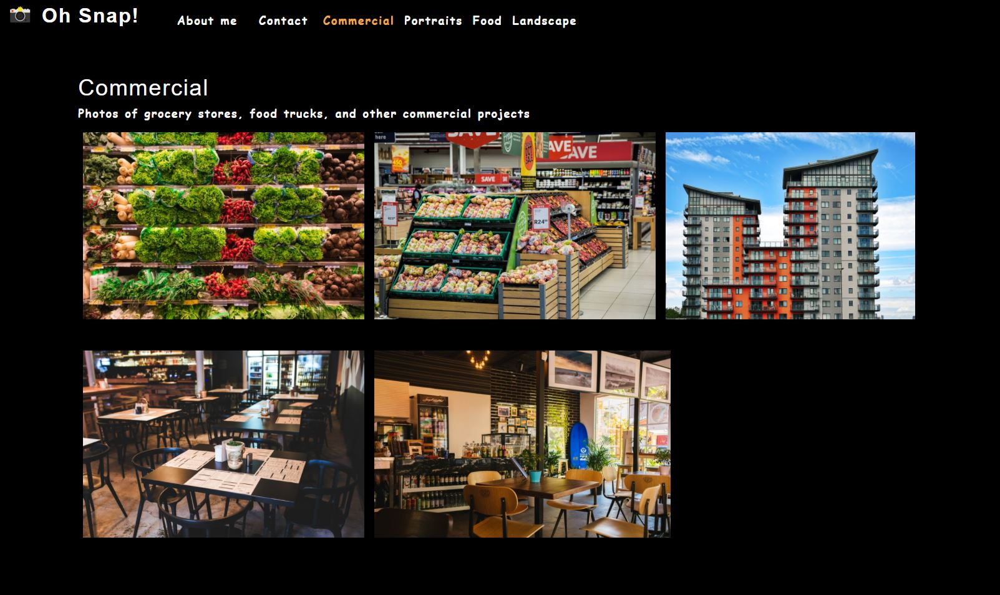
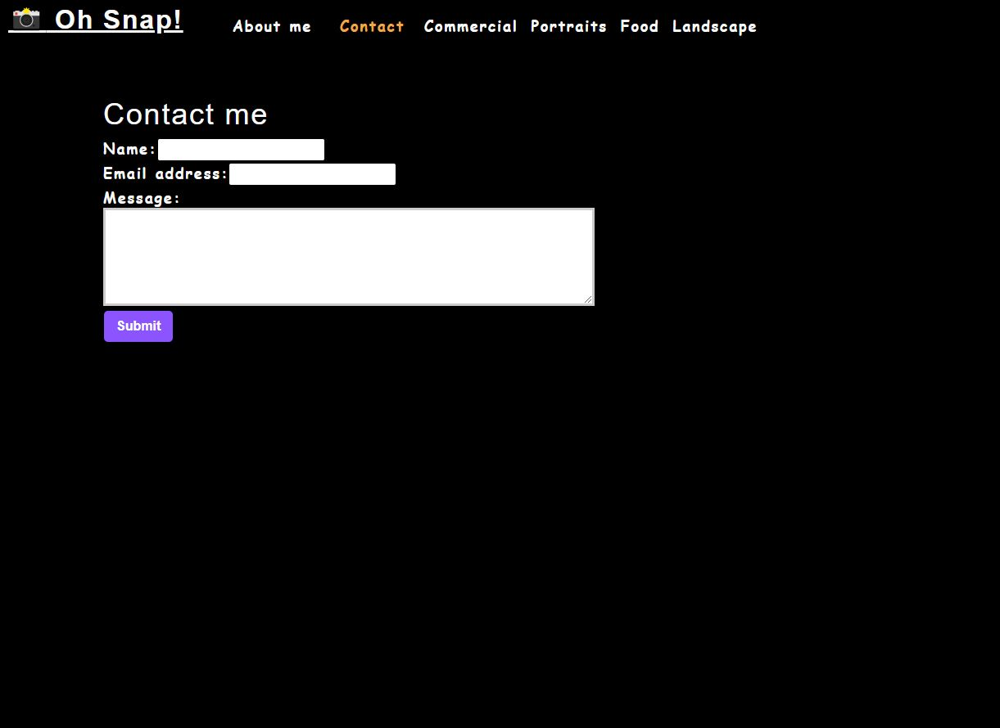
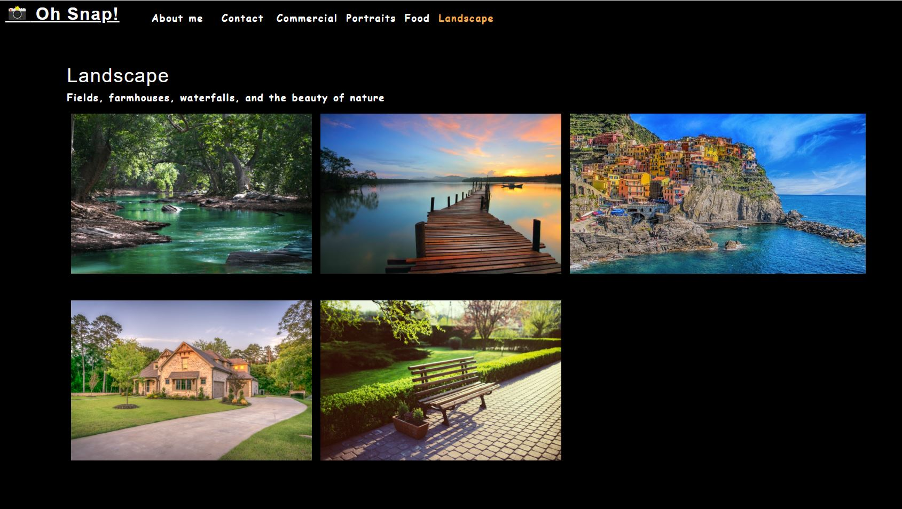

# photo-port


## Description :
Photo-port is a front-end single page application ( SPA ) built on React. 
This application uses components, JSX and tests. 

* The requirement from the client was as below:
```
• As a user, I can see the About section.

• As a user, I can see the Navigation menu.

• As a user, I can click on a category and view the photos associated with the selected category.

• As a user, when I click on a category, only photos associated with the selected category will be visible.

• As a user, I can enter my information into a form.

• As a user, I can submit the information.

• As a user, I can select a thumbnail of a photo.

• As a user, the selected photo is viewable in a modal.
```

## Languages and other components used : 
```
   * npm (node package manager) 
   * React
```

## How to install : 

 To install the application in your computer follow the steps below: 

   Clone the repository in your computer :
    - open the command line and go to the directory where you want to clone the repository.
    - then clone the repo by typing : " git clone git@github.com:miraj00/photo-port "
 
### How to Use the application : 

First run " npm start " command in command prompt to start the server ( It should automatically open the browser and direct to http://localhost:3000/ , if it does not then follow step manually) and then go to the browser and browse http://localhost:3000/ to test the application in local computer. Below are few command line codes to help with running the application
```
### `npm start`

Runs the app in the development mode.\
Open [http://localhost:3000](http://localhost:3000) to view it in the browser.

The page will reload if you make edits.\
You will also see any lint errors in the console.

### `npm test`

Launches the test runner in the interactive watch mode.\

### `npm run build`

Builds the app for production to the `build` folder.\
It correctly bundles React in production mode and optimizes the build for the best performance.
```

## Below is the screenshot and Deployed application of the Project as per client request ## 





### Deployed Sites ##

[Please click here to see deployed application on Github](https://miraj00.github.io/photo-port/)
